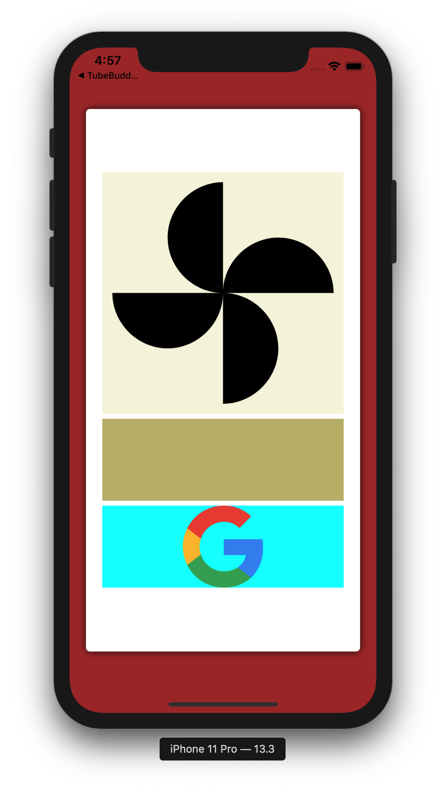

# XamFormsSample: SVG support with FFImageLoading
This branch is an example of using svg images in a Xamarin.Forms app, utilizing the [FFImageLoading](https://github.com/luberda-molinet/FFImageLoading) library.

As I was working with SVGs, I found some cool ones on <a target="_blank" href="https://icons8.com/icons/set/google-logo">Google icon</a> icon by <a target="_blank" href="https://icons8.com">Icons8</a>. You'll see these in the ['SVGs' folder](https://github.com/jbachelor/XamFormsSample/tree/svg/XamFormsSample/SVGS). There is the original one I downloaded, and then the modified one. At this point in time, only the modified svg will display in a Xamarin.Forms app. 

I'm fairly new to svg images, so I cannot tell you if the modifications I've made are truly safe, or good... So please beware!

