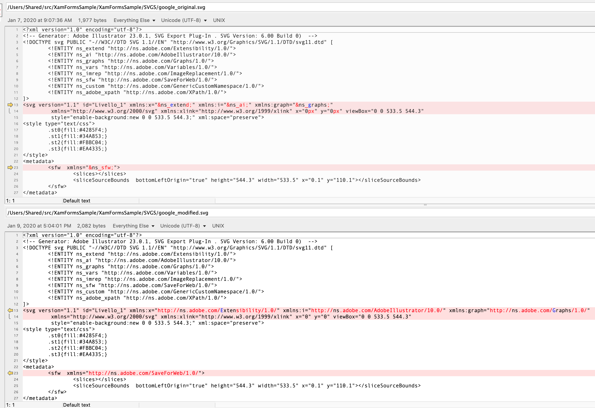

# XamFormsSample: SVG support with FFImageLoading
This branch is an example of using svg images in a Xamarin.Forms app, utilizing the [FFImageLoading](https://github.com/luberda-molinet/FFImageLoading) library.

As I was working with SVGs, I found a cool one on <a target="_blank" href="https://icons8.com/icons/set/google-logo">Google icon</a> icon by <a target="_blank" href="https://icons8.com">Icons8</a>. You'll see it in the ['SVGs' folder](https://github.com/jbachelor/XamFormsSample/tree/svg/XamFormsSample/SVGS) - it's the one called 'google_original.svg'.

Looking at the screenshot below, notice that the middle row of the layout has no image. It *should* be displaying google_original.svg, but there is something about the image that is not jiving with either Xamarin.Forms or FFImageLoading.

I opened up google_original.svg in a text editor, and compared it with the working svg in the first row (toys24px.svg). Using my very best luck (read: "trial & error for an embarassingly lengthy period of time"), I found some modifications I could make that would make the app happy with the svg image (google_modified.svg). I essentially took what look to me like a series of aliases (defined in the "!ENTITY" blocks) and just replaced the alias with the full string it was representing in the actual svg block of code.

## Warning!
I'm fairly new to svg images, so I cannot tell you if the modifications I've made are truly safe, or good... So please beware!